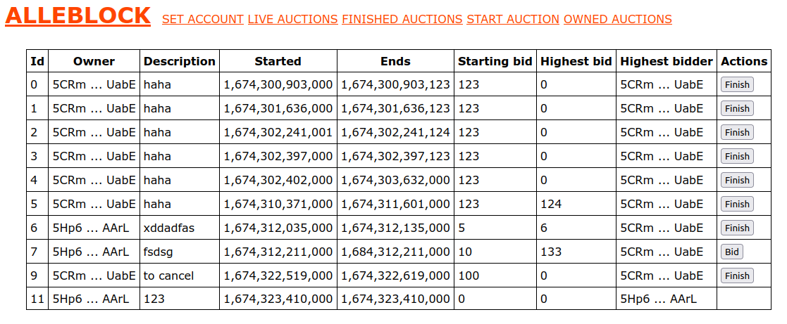

# alleblock
Auction platform on blockchain

<kbd>
    
</kbd>

## Setup
1. Install latest nodejs.
2. Deploy (nft storage and nft alleblock) or alleblock contracts.
3. Setup alleblock contract address in `server/main.js`.
4. Run server
    ```
    node main.js
    ```
5. Open `client/index.html` in firefox (it may not be working in chrome when hosted locally).
    
